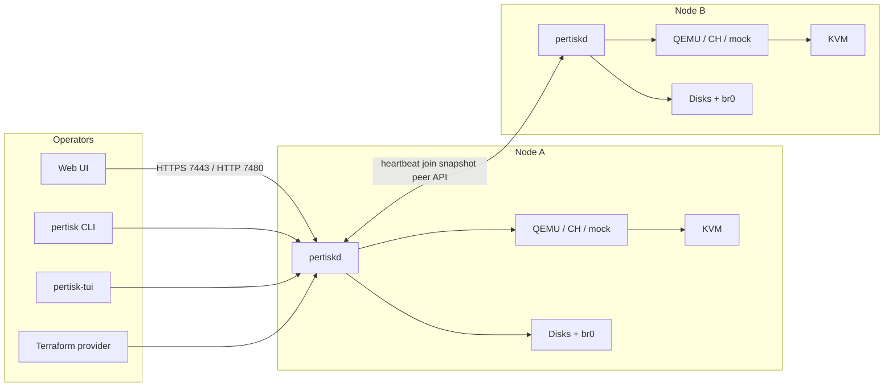
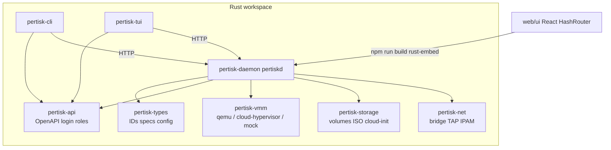
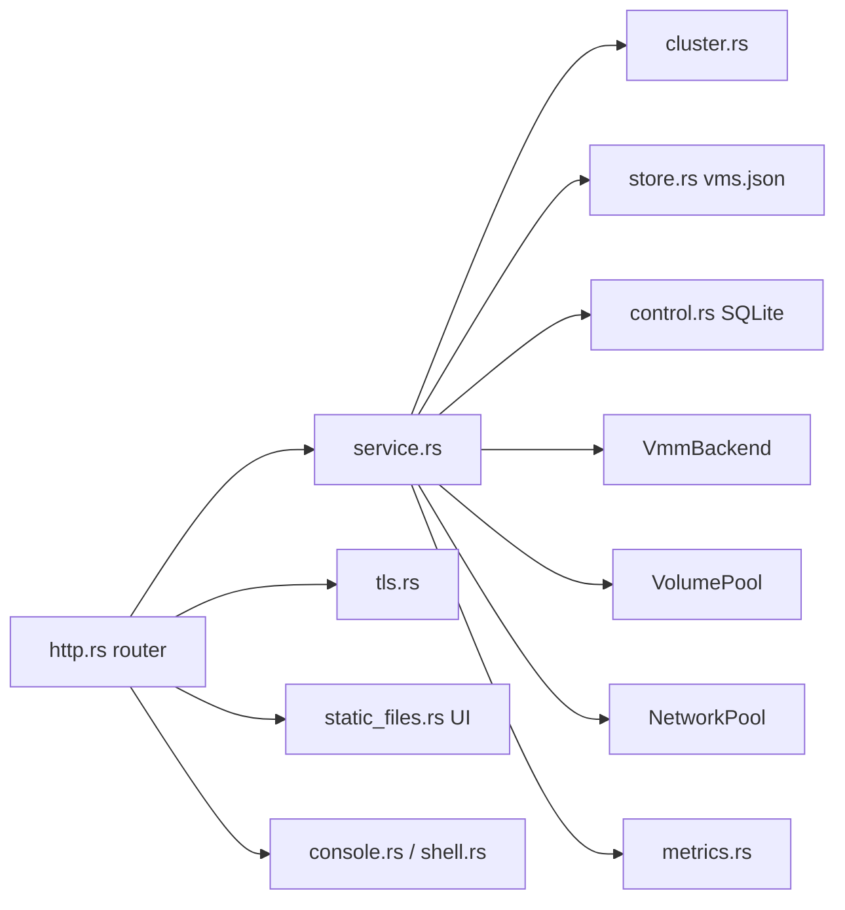
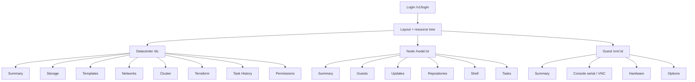
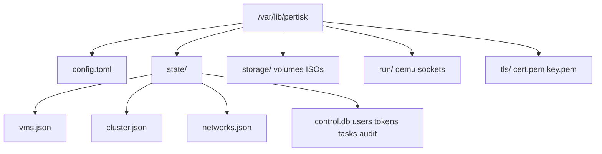
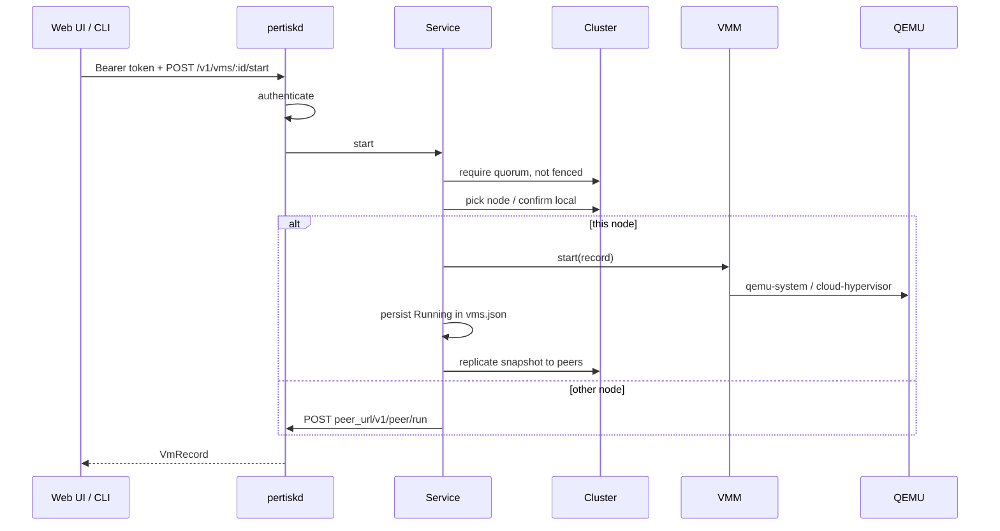
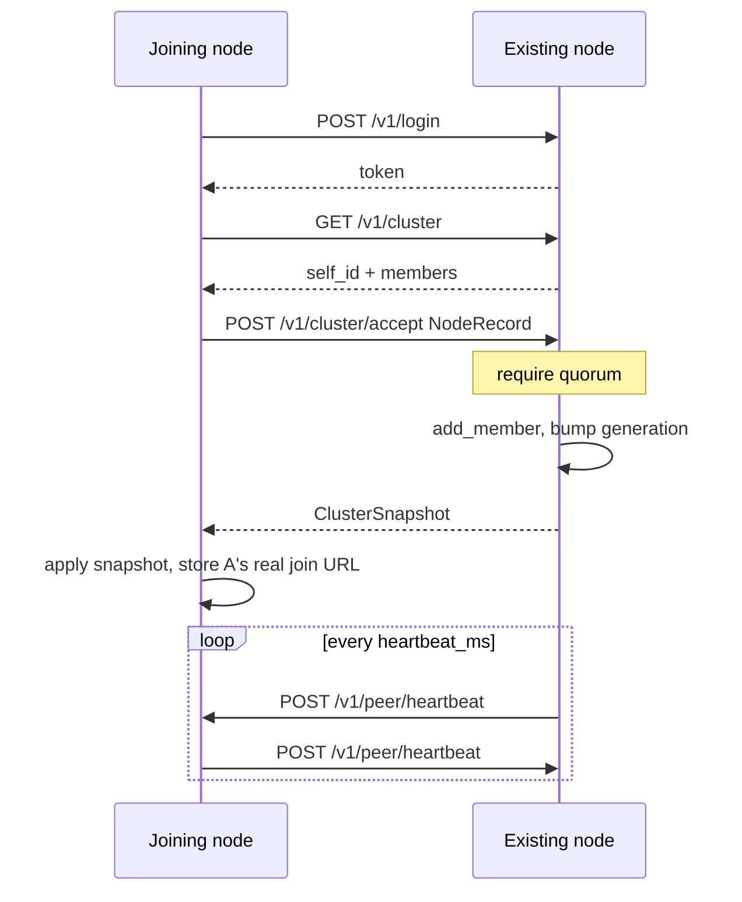
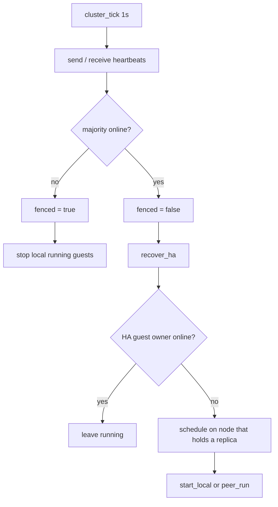
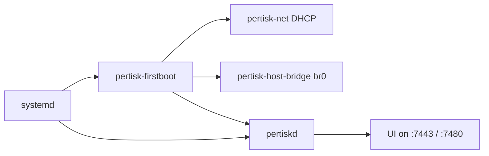

# Pertisk architecture

Pertisk is a Proxmox-like KVM control plane. Each hypervisor runs **`pertiskd`**, which serves the web UI, REST API, and cluster protocol. Operators use the UI, CLI, TUI, or Terraform — not SSH — for day-to-day VM work.

| Surface | Bind | Notes |
| --- | --- | --- |
| HTTP API + UI | `0.0.0.0:7480` | Cluster heartbeats use this URL (`peer_url`) |
| HTTPS API + UI | `0.0.0.0:7443` | Self-signed cert; join from the UI typically uses this |
| Home | `/var/lib/pertisk` (appliance) or `~/.pertisk` | Config, state, volumes, TLS |

Writes require **majority quorum**. A node that loses quorum **fences** (stops local guests) so the majority can HA-restart them.

---

## 1. System context

Guests attach to a host bridge (`br0` after `pertisk-host-bridge`) and get LAN DHCP/SLAAC like any other machine on the switch.

---

## 2. Component diagram (crates)

| Crate | Role |
| --- | --- |
| `pertisk-types` | VM/volume/network/cluster records, `HostConfig`, address probing |
| `pertisk-api` | Login, roles, OpenAPI document |
| `pertisk-daemon` | Axum HTTP/HTTPS, `Service`, cluster, auth, metrics, embedded UI |
| `pertisk-vmm` | Start/stop/shutdown/restart guests |
| `pertisk-storage` | Sparse replica files or Ceph RBD; ISO; cloud-init seed |
| `pertisk-net` | Host bridges, TAP, neighbour/IP discovery |
| `pertisk-cli` / `pertisk-tui` | Operator clients |

Daemon modules inside `pertisk-daemon`:

---

## 3. UI structure

The UI is a React HashRouter baked into `pertiskd` (`crates/pertisk-daemon/static/`). Layout holds inventory (`useInventory` → `/v1/host`, `/v1/cluster`, `/v1/vms`, …).

---

## 4. Data on a node

`$PERTISK_HOME` (appliance: `/var/lib/pertisk`):

- **Inventory** (VMs) is JSON replicated through cluster snapshots.
- **Users / tokens / tasks / audit** live in SQLite (`control.db`).
- **Volume bytes** are local sparse files (replica backend) or RBD.

---

## 5. Request flow (operator → guest)

Create-guest wizard (UI) is several calls: define VM → create/clone volume → attach disk → optional ISO/cloud-init → attach NIC → start.

---

## 6. Cluster join flow

`peer_url` must be a **LAN** address (not `127.0.0.1`). Unspecified listen `0.0.0.0:7480` is advertised as `http://<lan-ip>:7480`. HTTPS join (`https://<lan-ip>:7443`) is accepted with the peer’s self-signed cert.

Quorum: `online * 2 > total` (1 of 1 yes, 1 of 2 no, 2 of 3 yes).

---

## 7. Fence and HA flow

Runtime disk writes stay on the running node. Replicas are pushed on **stop** and before **migrate**. If the owner dies mid-run, unsynced writes after the last stop can be lost unless `storage.backend = "rbd"`.

---

## 8. Appliance boot

First boot copies `/etc/pertisk/config.toml` → `/var/lib/pertisk/config.toml`, sets `node_name` from the hostname when missing, writes the admin password, and seeds the `lan` network on `br0`.

---

## Related docs

- [CLUSTER_OPERATIONS.md](CLUSTER_OPERATIONS.md) — 3-node setup, quorum, fencing
- [GRAPHICS_CONSOLE.md](GRAPHICS_CONSOLE.md) — serial vs VNC
- [IMPLEMENTATION_SUMMARY.md](IMPLEMENTATION_SUMMARY.md) — feature checklist
